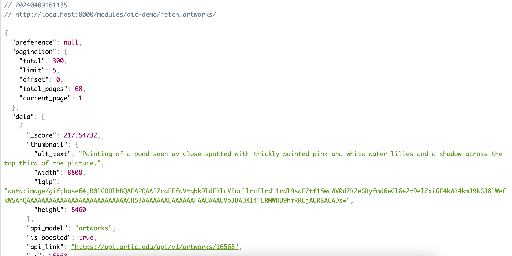

# AicDemo - Django Backend for Artwork Display and Search App

This is a Django application that serves as the backend for the AicDemo React Native app. It provides an API endpoint for fetching and searching artworks housed at the [Art Institute of Chicago](https://api.artic.edu/docs/#introduction).



## Features

- **Artwork API**: The application provides an API endpoint for fetching artworks. The endpoint supports pagination and filtering by search term.
- **Database Models**: The application includes a Django model for artworks, which includes fields for the artwork's title, artist, image URL, and other details.
- **Admin Interface**: The application includes a Django admin interface for managing the artworks in the database.

## Installation

1. Log into the Crowdbotics platform
2. Navigate to Studio and click on Modules
3. Find the "Artwork Search (backend)" module
4. Click the install button

## Local Setup

If you would like to develop with this module locally on your machine, you will need to install 'corsheaders'. You can find more information about this package [here](https://pypi.org/project/django-cors-headers/). These are the steps I followed to get this working for me:

1. cd to demo/backend and run in terminal

```bash
pipenv install django-cors-headers
```

2. In settings.py in the backend/demo directory add:

```python
INSTALLED APPS=[
  "corsheaders",
  ...
]
```

3. In the same settings.py file add the following to the MIDDLEWARE array:

```python
MIDDLEWARE=[
"corsheaders.middleware.CorsMiddleware",
...,]
```

4. In the same settings.py file add:

```python
   CORS_ORIGIN_WHITELIST = [
   "http://localhost:8000",
   "http://localhost:8080",
   ]

```

5. From demo/backend run the following command in terminal:

```bash
docker compose -p your-project-name up --build
```

## License

This project is licensed under the MIT License.

## Author
Jason Kozel
jason.kozel@crowdbotics.com