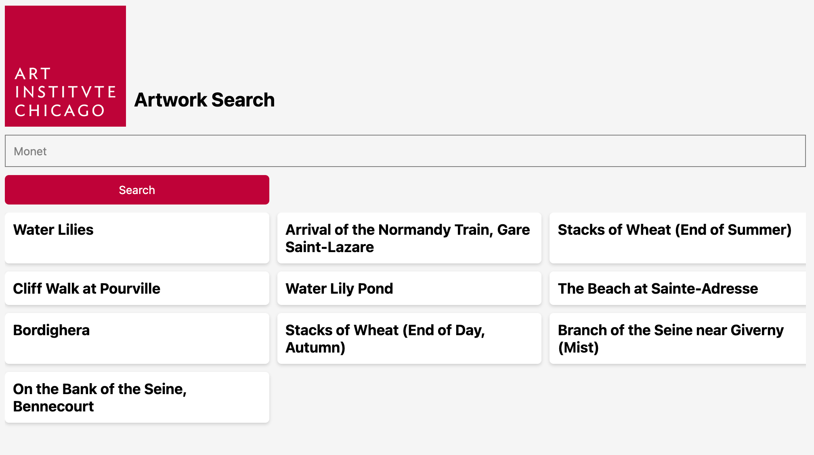

# Project Title

Simple overview of use/purpose.


## Description

This is a React Native application named AicDemo. The application fetches and displays artworks from an API provided by the Art Institute of Chicago (AIC). It includes a search functionality that allows users to search for specific artworks at AIC. This frontend module is designed to be used with the Django-aic-demo backend module.

Key features of the application include:

1. Search Functionality: The application includes a search bar (TextInput) where users can enter a search term. The state of the search term is managed using the useState hook.

2. Artwork Display: The artworks fetched from the API are stored in the artworks state variable and displayed using a FlatList component.

3. Artwork Details Modal: When an artwork is selected, a modal is displayed with more details about the artwork. The visibility of the modal and the selected artwork are managed using the useState hook.

4. Loading Indicator: While the artworks are being fetched from the API, a loading indicator (ActivityIndicator) is displayed. The state of the loading indicator is managed using the useState hook.

5. Icon Integration: The application uses the react-native-vector-icons library to display an icon in the application. The Ionicons font is loaded into the application using a @font-face CSS rule.

The application uses the useEffect hook to fetch the artworks from the API when the component is first rendered. The isLoading state variable is set to true before the fetch request is made and set to false once the data is received and set.

### Dependencies

- react-native-render-html
- react-native-vector-icons

### Installing

1. Log into the Crowdbotics platform
2. Navigate to Studio and click on Modules
3. Click the install button
4. Be sure to change the

## Help

Please see below for an example of how to get react-native-vector-icons working with your Crowdbotics application.

```
import Icon from "react-native-vector-icons/Ionicons"
import iconFont from "react-native-vector-icons/Fonts/Ionicons.ttf"
const iconFontStyles = `@font-face {
  src: url(${iconFont});
  font-family: Ionicons;
}`
const style = document.createElement("style")
document.head.appendChild(style)
style.type = "text/css"
if (style.styleSheet) {
  style.styleSheet.cssText = iconFontStyles
} else {
  style.appendChild(document.createTextNode(iconFontStyles))
}
```

## Authors

Jason Kozel
jason.kozel@crowdbotics.com

## Version History

- 0.1
  - Initial Release

## License

This project is licensed under the MIT License
